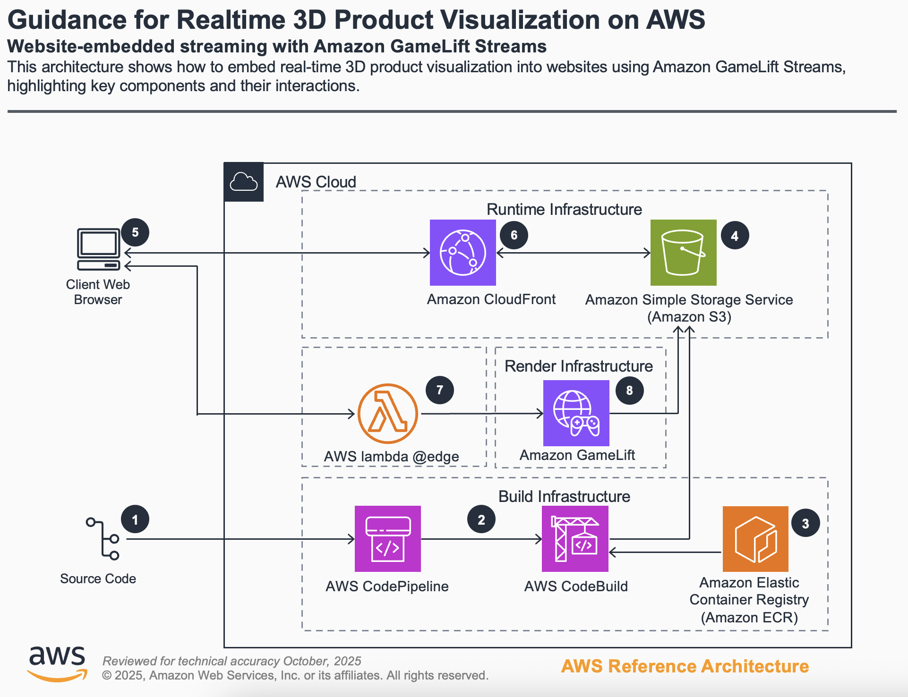

# Guidance for Realtime 3D Product Visualization on AWS

## Table of Contents

1. [Overview](#overview)
2. [Architecture](#Architecture)
3. [Cost](#cost)
4. [Prerequisites](#prerequisites)
5. [Deployment](#deployment-steps)
6. [Cleanup](#deployment-validation-user-guide-and-cleanup)
7. [Next Steps](#next-steps)
8. [Known issues and additional considerations](#Known-issues-and-additional-considerations)
9. [Authors](#authors)

## Overview

This Guidance demonstrates how to build and deploy a real-time 3D product visualization solution using Amazon GameLift Streams on AWS. It provides a complete implementation that enables customers to stream interactive 3D product experiences directly to web browsers without requiring end-users to download or install any software.

**Why did we build this Guidance?**

Traditional 3D product visualization requires powerful client-side hardware and software installations, creating barriers for customers who want to view products in 3D. This Guidance solves that problem by leveraging cloud-based rendering and streaming, making high-quality 3D visualization accessible from any device with a web browser.

**What problem does this Guidance solve?**

- Eliminates the need for powerful client-side hardware to render complex 3D models
- Removes software installation requirements for end-users
- Provides a scalable, cloud-based solution for streaming interactive 3D content
- Demonstrates integration of Amazon GameLift Streams with a web application
- Includes complete CI/CD pipeline for automated deployment and updates

### Architecture

The solution consists of three main components:

1. **Backend Infrastructure**: Amazon GameLift Streams for hosting and streaming the 3D application
2. **Frontend Infrastructure**: Amazon CloudFront distribution with AWS WAF protection serving the web application
3. **CI/CD Pipeline**: AWS CodePipeline and AWS CodeBuild for automated deployment



**Architecture Flow:**

1. User accesses the web application through Amazon CloudFront
2. AWS WAF validates the request and applies security rules
3. AWS Lambda@Edge function creates a streaming session with Amazon GameLift Streams
4. Amazon GameLift Streams provisions compute resources and launches the 3D application
5. The application streams interactive 3D content back to the user's browser
6. User interacts with the 3D product in real-time through the browser

### Cost

_You are responsible for the cost of the AWS services used while running this Guidance. As of October 2025, the cost for running this Guidance with the default settings in the US West (Oregon) region is approximately $150-$300 per month, depending on usage patterns and the number of concurrent streaming sessions._

The primary cost drivers include:

- **Amazon GameLift Streams**: Charged per streaming hour based on instance type and concurrent sessions
- **Amazon CloudFront**: Data transfer and request charges
- **Amazon S3**: Storage for application binaries and website assets
- **AWS Lambda**: Invocations for edge functions
- **AWS CodeBuild**: Build minutes for CI/CD pipeline
- **AWS WAF**: Web ACL rules and request charges

_We recommend creating a [Budget](https://docs.aws.amazon.com/cost-management/latest/userguide/budgets-managing-costs.html) through [AWS Cost Explorer](https://aws.amazon.com/aws-cost-management/aws-cost-explorer/) to help manage costs. Prices are subject to change. For full details, refer to the pricing webpage for each AWS service used in this Guidance._


### Cost Table

The following table provides a sample cost breakdown for deploying this Guidance with the default parameters in the US West (Oregon) Region for one month with moderate usage (100 streaming hours per month):

| AWS service  | Dimensions | Cost [USD] |
| ----------- | ------------ | ------------ |
| Amazon GameLift Streams | 100 streaming hours per month (g4dn.xlarge equivalent) | $ 150.00 |
| Amazon CloudFront | 50 GB data transfer, 100,000 requests | $ 8.50 |
| Amazon S3 | 10 GB storage, 100,000 PUT/GET requests | $ 0.50 |
| AWS Lambda | 1,000,000 invocations, 128 MB memory | $ 0.20 |
| AWS CodeBuild | 100 build minutes per month | $ 1.00 |
| AWS WAF | 1 Web ACL, 2 rules, 100,000 requests | $ 7.00 |
| **Total estimated cost** | | **$ 167.20/month** |

**Note**: Costs will vary significantly based on the number of concurrent streaming sessions, session duration, and data transfer volumes.

## Prerequisites

### Operating System

These deployment instructions are optimized to best work on **macOS or Linux**. Deployment on Windows may require additional steps or modifications to the provided scripts.

**Required Software:**

- **[Node.js](https://nodejs.org/en/download)** `20.10.0` or higher (up to `20.19.3`)
- **[Git](https://git-scm.com/downloads)** `2.39.3` or higher
- **[GNU Make](https://www.gnu.org/software/make/)** `3.81` or higher
- **[zip](https://infozip.sourceforge.net/)** `3.0` or higher
- **[curl](https://curl.se/download.html)** `8.1.2` or higher
- **[jq](https://jqlang.org/)** `1.6` or higher
- **[AWS CLI V2](https://docs.aws.amazon.com/cli/latest/userguide/getting-started-install.html)** `2.4.0` or higher

### Third-party tools

**(optional) For building the placeholder 3D application locally:**

- **[Docker](https://docs.docker.com/engine/install/)** `20.10.23` or higher - Required to build the Rust-based 3D application

### AWS account requirements

1. **Active AWS Account** with appropriate permissions to create and manage:
   - Amazon GameLift Streams resources
   - Amazon CloudFront distributions
   - Amazon S3 buckets
   - AWS Lambda functions
   - AWS WAF Web ACLs
   - AWS CodePipeline and CodeBuild projects
   - IAM roles and policies

2. **AWS CLI Configuration**: Configure AWS CLI with credentials that have administrative access (or equivalent permissions)
   ```bash
   aws configure
   ```
   This creates `~/.aws/credentials` and `~/.aws/config` files with your AWS credentials.

### aws cdk bootstrap

This Guidance uses AWS CDK for infrastructure deployment. If you are using AWS CDK for the first time in your AWS account and region, you must bootstrap your environment.

The bootstrap process is automated as part of the deployment steps below. The Guidance will create a custom CDK bootstrap stack with the following naming convention: `pvagls-<stage>-cdk-toolkit-<deploy-id>`

**Note**: The bootstrap process creates an Amazon S3 bucket and other resources required by AWS CDK. These resources incur minimal costs.

### Service limits

**Amazon GameLift Streams**: Default quotas may limit the number of concurrent streaming sessions. You may need to request quota increases for:
   - Maximum concurrent streams per stream group
   - Maximum applications per account
   - Maximum stream groups per account
   
   To request quota increases, visit the [Service Quotas console](https://console.aws.amazon.com/servicequotas/) and search for "GameLift Streams".

### Supported Regions

**Amazon GameLift Streams Region Support**: This Guidance must be deployed in a region that supports Amazon GameLift Streams. Supported regions include:
   - US East (N. Virginia) - `us-east-1`
   - US West (Oregon) - `us-west-2`
   - Europe (Frankfurt) - `eu-central-1`
   - Asia Pacific (Tokyo) - `ap-northeast-1`
   
   For the complete list of supported regions, see the [Amazon GameLift Streams documentation](https://docs.aws.amazon.com/gameliftstreams/latest/developerguide/regions-quotas-rande.html).


## Deployment Steps

Follow these steps from a terminal to deploy the Guidance to your AWS account:

1. **Clone the repository**
   ```bash
   git clone https://github.com/aws-solutions-library-samples/guidance-for-realtime-3d-product-visualization-on-aws
   cd guidance-for-realtime-3d-product-visualization-on-aws
   ```

2. **Navigate to the deployment directory**
   ```bash
   cd deployment/amazon-gamelift-streams
   ```

3. **Install global dependencies** (one-time setup)
   ```bash
   make setup
   ```
   This installs the required global npm packages for the build process.

4. **Install project dependencies**
   ```bash
   make install
   ```
   This generates `package.json` from the TypeScript configuration files and installs all dependencies.

5. **Configure AWS deployment settings**
   
   Edit the configuration file `config/.env` and update the following values for the `main` stage:
   
   ```bash
   # AWS CLI profile name (must exist in ~/.aws/credentials)
   aws_main_cli_profile=pviz1
   
   # Your AWS account ID
   aws_main_account_id=123456789012
   
   # Deployment region (must support Amazon GameLift Streams)
   aws_main_region=us-west-2
   
   # Unique deployment identifier
   aws_main_deploy_id=v-001
   
   # CDK qualifier (must be alphanumeric, max 10 chars)
   aws_main_cdk_qualifier=pvaglsv001
   ```

6. **Deploy the complete infrastructure**
   
   Run the following command to bootstrap AWS CDK, deploy CI/CD infrastructure, and trigger the deployment pipeline:
   ```bash
   make -f makefile.aws deploy/main
   ```
   > Warning: slow speed ahead. This takes a bit. If CICD fails (and it might), just run the command again until it succeeds.

7. This stack deploys a cicd pipeline in AWS Codebuild. Once stack deployment finishes, go to your AWS Codebuild console and check the building pipeline status (It can take a few minutes to start). Once CICD finishes, you can go to the deployed website to start streaming the product visualizer. From your terminal, run:
    ```bash
    make -f makefile.aws open-website/main
    ```

## Deployment validation, User guide and Cleanup
For detailed guidance deployment steps, running the guidance and cleanup resources as a user please see the [Implementation Guide](./deployment/amazon-gamelift-streams/readme.md)


## Next Steps

After successfully deploying the Guidance, consider these enhancements:

### Customize the 3D Application

Replace the placeholder Rust application with your own 3D product visualization:

1. **Develop your custom application** using Unreal Engine, Unity, or a custom rendering engine
   - Ensure the application is supported by Amazon GameLift Streams
   - Target Linux (x86_64) as the build platform

2. **Update the placeholder-app directory** with your application source code:
   ```bash
   # Replace the Rust source code in deployment/placeholder-app/src/
   # Or update the Dockerfile to build your application instead
   ```

3. **Modify the Docker build configuration** (if needed):
   - Edit `deployment/placeholder-app/makefile.docker` to match your build requirements
   - Update `deployment/placeholder-app/Dockerfile` if using different build tools
   - Ensure the output binary is placed at `target/x86_64-unknown-linux-gnu/release/app`

4. **Trigger the CI/CD pipeline** to build and deploy your custom application:
   ```bash
   cd deployment/amazon-gamelift-streams
   make -f makefile.aws start/cicd/main
   ```
   
   The CI/CD pipeline will:
   - Build your application Docker container in AWS CodeBuild
   - Compile your application binary inside the container
   - Upload the binary to Amazon S3
   - Deploy it to Amazon GameLift Streams

**Note**: The application is built automatically in the AWS CodeBuild environment during the CI/CD process. You don't need to build it locally unless you want to test it first. The CodeBuild environment has Docker support and will execute the Docker-based build process defined in your makefile.


## Known issues and additional considerations

### Known Issues

**Issue: CI/CD Pipeline Fails on First Run**

If the CI/CD pipeline fails during the initial deployment, this is often due to timing issues with resource creation. 

**Resolution**: Simply run the deployment command again:
```bash
make -f makefile.aws deploy/main
```

**Issue: Public IP Address Changes**

The sample restricts website access to your public IP address at deployment time. If your IP changes, you'll be blocked by AWS WAF.

**Resolution**: Update the AWS WAF IP set in the AWS Console, or redeploy:
```bash
make -f makefile.aws deploy/main
```

**Issue: Browser Compatibility**

The streaming functionality requires modern browser support for WebRTC and ES6 modules.

**Resolution**: Use a supported browser version:
- Chrome 60+
- Firefox 60+
- Safari 11+
- Edge 18+

### Additional Considerations

**Cost Management**

- Amazon GameLift Streams charges per streaming hour. Inactive sessions should be terminated promptly.
- Consider implementing session time limits and automatic termination.

**Security Considerations**

- This Guidance creates public endpoints protected by AWS WAF.
- The default configuration restricts access to a single IP address.
- For production use, implement proper authentication and authorization.

**Performance Considerations**

- Streaming quality depends on end-user network bandwidth and latency.
- Amazon GameLift Streams instance types should match your application's rendering requirements.
- Consider geographic proximity between users and deployed regions.

### Feedback

For any feedback, questions, or suggestions, please use the issues tab in this repository.

### License

This source is licensed under the MIT-0 License. See the [LICENSE](./LICENSE) file for more information.

## Notices 

*Customers are responsible for making their own independent assessment of the information in this Guidance. This Guidance: (a) is for informational purposes only, (b) represents AWS current product offerings and practices, which are subject to change without notice, and (c) does not create any commitments or assurances from AWS and its affiliates, suppliers or licensors. AWS products or services are provided “as is” without warranties, representations, or conditions of any kind, whether express or implied. AWS responsibilities and liabilities to its customers are controlled by AWS agreements, and this Guidance is not part of, nor does it modify, any agreement between AWS and its customers.*


## Authors
- [Evan Helda](https://www.linkedin.com/in/evanhelda/), Principal Spatial compute GTM
- Frank Lovechio, Sr. Spatial Compute SA
- [Ignacio Sanchez](https://www.linkedin.com/in/igsalvar/), Spatial Compute SA
