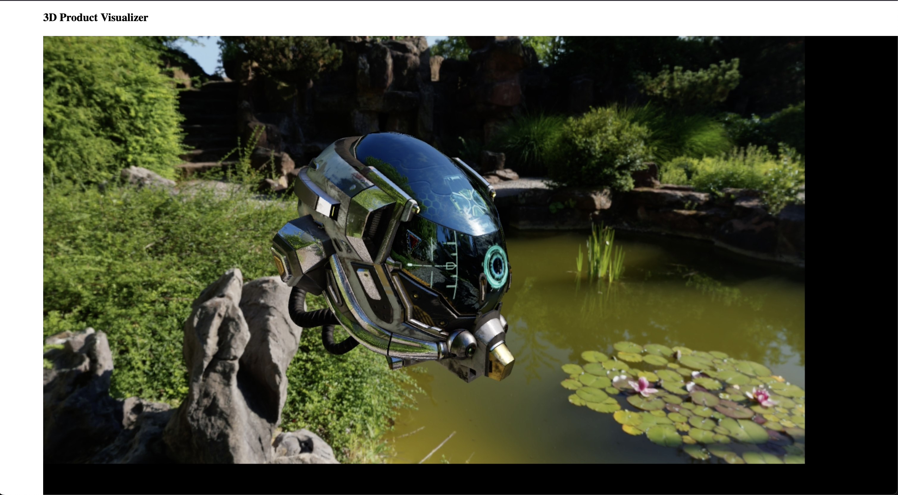
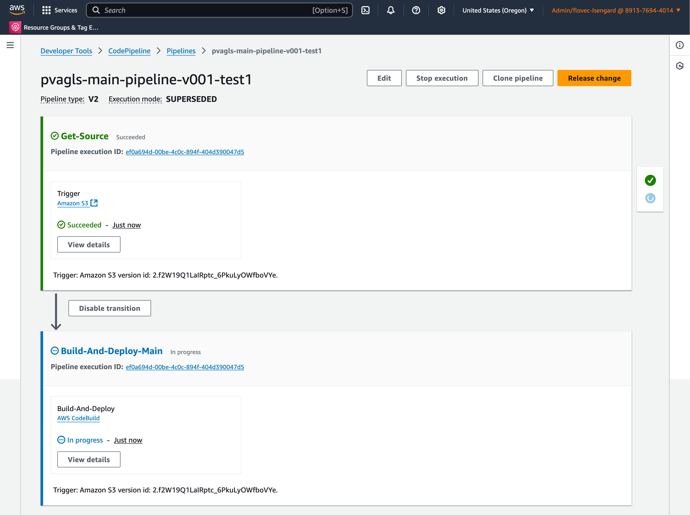

# 3D Product Visualization - Amazon GameLift Streams
This software provides an Amazon GameLift Streams implementation for 3D product visualization as dicussed in the AWS Guidance [here](https://aws.amazon.com/solutions/guidance/3d-product-visualization/).






## Development Pre-Reqs
1. 'Nix machine (I'm on MacOS w/ M3, YMMV elsewhere)
1. [Node.js](https://nodejs.org/en/download) `20.10.0`
1. [Git](https://git-scm.com/downloads) `git version 2.39.3 (Apple Git-145)` (required by npm to download and install packages from Github, used when `make setup` is invoked)
1. [make](https://www.gnu.org/software/make/) `3.81` (GNU)
1. [zip](http://www.info-zip.org/) `Zip 3.0 (July 5th 2008)` (used to upload some files to Amazon S3)
1. [curl](https://curl.se/download.html) `8.1.2 (x86_64-apple-darwin22.0) libcurl/8.1.2 (SecureTransport) LibreSSL/3.3.6 zlib/1.2.11 nghttp2/1.51.0` (used for retrieving public IP, among other things)
1. [jq](https://jqlang.github.io/jq/) `1.6` (used for working with JSON in CLI)

### Development Pre-Reqs / Usage
1. [Firefox](https://www.mozilla.org/en-US/firefox/new/) `115.2.1esr (64-bit)`

### Development Pre-Reqs / AWS
While the placeholder application this software builds, deploys, and demonstrates 3D product visualization for runs locally, the infrastructure required for streaming the application does _not_ run locally.

1. [AWS CLI V2](https://docs.aws.amazon.com/cli/latest/userguide/getting-started-install.html) `aws-cli/2.4.0 Python/3.8.8 Darwin/22.6.0 exe/x86_64 prompt/off` and an `~/.aws/credentials` file with active credentials

> The `~/.aws/credentials` file is normally created and configured by the [AWS CLI](https://aws.amazon.com/cli/) and a user, and often updated by single-sign on (SSO) software. The file is required to exist and for the credentials to be active in order to deploy anything, but how it gets there is up to you.

----

## AWS Setup
Configure the `<pvagls-src>/amazon-gamelift-streams/config/.env` file with your AWS information for the _main_ stage (this sample only has a _local_ and a _main_ stage, not development, staging, production, etc.). Edit this information, use next example as reference:

    aws_main_cli_profile=pvagls
    aws_main_account_id=891556944014
    aws_main_region=us-west-2
    aws_main_deploy_id=v001-test1
    aws_main_cdk_qualifier=pvagls1

Notes:
* `pvagls` is just shorthand for "3D Product Visualization - Amazon GameLift Streams"
* `aws_main_cli_profile` You can find more info about AWS cli profiles [here](https://docs.aws.amazon.com/cli/v1/userguide/cli-configure-files.html).

----

## Local Development
To install dependencies, from a terminal, run:

    make setup # Only need to do this once.
    make install

> Note: if this command fails, it's because your NPM global package directory is not on PATH. I used the command `echo $PATH | grep $(npm config get prefix)` to validate it was. If you have trouble figuring out how to add your NPM global package directory to PATH, just run `npm install` (we've bundled the necessary files into this source). 

To start viewing content and making changes to the website that initiates streaming sessions locally, from a terminal, run:

    make develop/website

This opens up a browser tab at [http://localhost:8080](http://localhost:8080). Making a change to a file reloads the page.

> If you'd like to validate business logic related to streaming sessions locally, _first_ deploy the sample to AWS (see "AWS Deploy" below), then update the `<pvagls-src>/amazon-gamelift-streams/config/.env` file with the AWS information for the _local_ stage:

    aws_local_gls_stream_group_id=<your stream group id>
    aws_local_gls_application_id=<your application id>

----

## AWS Deploy
> Make sure you've completed the instructions in the "AWS Setup" section of this readme.

To install dependencies, from a terminal, run:

    make setup # Only need to do this once.
    make install

> Note: if this command fails, it's because your NPM global package directory is not on PATH. I used the command `echo $PATH | grep $(npm config get prefix)` to validate it was. If you have trouble figuring out how to add your NPM global package directory to PATH, just run `npm install` (we've bundled the necessary files into this source). 

To bootstrap the AWS CDK for the _main_ stage, deploy CICD infra required for the _main_ stage to build and deploy your streaming application, and start the CICD process (which deploys multiple AWS CloudFormation stacks), from a terminal, run:

    make -f makefile.aws deploy/main

> Warning: slow speed ahead. This takes a bit. If CICD fails (and it might), just run the command again until it succeeds.

This stack deploys a cicd pipeline in AWS Codebuild. Once stack deployment finishes, go to your AWS Codebuild console and check the building pipeline status (It can take a few minutes to start). Once CICD finishes, you can go to the deployed website to start streaming the product visualizer. From a terminal, run:

    make -f makefile.aws open-website/main

### AWS Deploy / Update
The sample web application is restricted to your current public IP at deploy time. If your public IP changes, update the AWS WAF rule in the AWS Console, or, from a terminal, run:

    make -f makefile.aws deploy/main
    
To re-bootstrap the AWS CDK for the _main_ stage, from a terminal, run:

    make -f makefile.aws deploy/cdk/main

To re-deploy CICD infra required for the _main_ stage to build and deploy your streaming application, from a terminal, run:

    make -f makefile.aws cdk_action=synth deploy/cicd/main
    make -f makefile.aws deploy/cicd/main

To re-start the CICD process, upload the current source to a bucket (this triggers the build/deploy of your streaming application). From a terminal, run:

    make -f makefile.aws start/cicd/main

To _just_ update website content, from a terminal, run:

    make -f makefile.aws update-website/main
----
## Deployment Validation

Validate that the deployment completed successfully:

1. **Verify CloudFormation Stacks**
   
   Check that all CloudFormation stacks are in `CREATE_COMPLETE` or `UPDATE_COMPLETE` status:
   ```bash
   aws cloudformation list-stacks \
     --stack-status-filter CREATE_COMPLETE UPDATE_COMPLETE \
     --profile <your-profile> \
     --region <your-region>
   ```
   
   You should see the following stacks:
   - `pvagls-main-cdk-toolkit-<deploy-id>` (in both us-east-1 and your region)
   - `pvagls-main-cicd-<deploy-id>`
   - `pvagls-main-backend-<deploy-id>`
   - `pvagls-main-frontend-waf-<deploy-id>`
   - `pvagls-main-frontend-<deploy-id>`

2. **Verify Amazon GameLift Streams Resources**
   
   Check that the Amazon GameLift Streams application and stream group were created:
   ```bash
   aws gameliftstreams list-applications \
     --profile <your-profile> \
     --region <your-region>
   ```

3. **Verify Amazon S3 Buckets**
   
   Confirm that the required S3 buckets exist and contain files:
   ```bash
   aws s3 ls --profile <your-profile>
   ```
   
   You should see buckets for:
   - Application binaries
   - Website assets
   - CloudFront access logs
   - Application access logs

4. **Verify Amazon CloudFront Distribution**
   
   Check that the CloudFront distribution is deployed and enabled:
   ```bash
   aws cloudfront list-distributions \
     --profile <your-profile> \
     --query 'DistributionList.Items[?Comment==`pvagls-main-frontend-<deploy-id>`]'

----

## AWS / Destroy
To remove all the AWS infrastructure for the _main_ stage, from a terminal, run:

    make -f makefile.aws destroy/main

> Warning: slow speed ahead. This takes a bit. If cleaning up fails (and it might), just run the command again until it succeeds.

----

## License Notes
This source is licensed under the MIT-0 License. See the [license.txt](../license.txt) file for more information.

Although this repository is released under the MIT-0 license, an indirect build dependency uses the third party jackspeak@3.4.3 project. The jackspeak@3.4.3 project's licensing includes the BlueOak-1.0.0 license.

Although this repository is released under the MIT-0 license, an indirect build dependency uses the third party path-scurry@1.11.1 project. The path-scurry@1.11.1 project's licensing includes the BlueOak-1.0.0 license.

Although this repository is released under the MIT-0 license, an indirect build dependency uses the third party package-json-from-dist@1.0.1 project. The package-json-from-dist@1.0.1 project's licensing includes the BlueOak-1.0.0 license.

Although this repository is released under the MIT-0 license, the included Amazon GameLift Streams WebSDK dependency specifices its own license, which can be found [here](./src/frontend/scripts/AmazonGameLiftStreamsWebSDK-v1.0.0/LICENSE.txt).

----

## Security
See [contributing](../readme/contributing.md#security-issue-notifications) for more information.

----

## Code of Conduct
See [code of conduct](../readme/code-of-conduct.md) for more information.