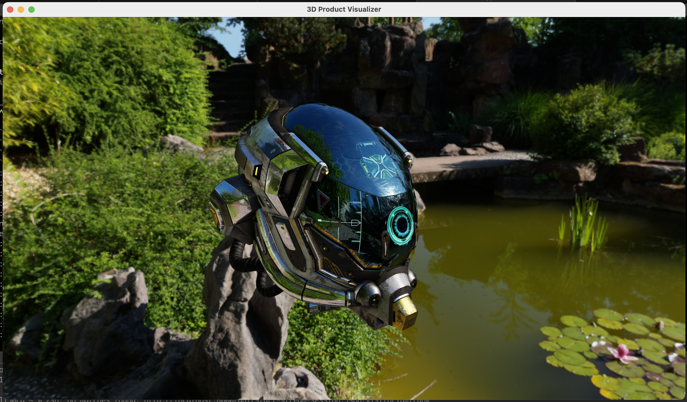

# 3D Product Visualization - Application Placeholder
This source provides a (Rust-based) application that is built and deployed by the 3D product visualization architecture implementations. It serves as a "placeholder" - swap it out with your own!

## Development Pre-Reqs
1. 'Nix machine (We're on MacOS)
1. [make](https://www.gnu.org/software/make/) `3.81` (GNU)
1. [rustup](https://rustup.rs/) `1.28.1 (f9edccde0 2025-03-05)` - used to update the Rust compiler and dependency manager
1. [rustc](https://doc.rust-lang.org/rustc/index.html) `1.85.1 (4eb161250 2025-03-15)` - used to compile the Rust application
1. [cargo](https://doc.rust-lang.org/cargo/) `cargo 1.85.1 (d73d2caf9 2024-12-31)` - used to manage the Rust application's dependencies
1. [Docker](https://docs.docker.com/get-docker/) `Docker version 20.10.23, build 7155243` (to to build the application)

----

## Local Development
To develop the application locally, from a terminal, run:

    make setup # Only need to do this once.
    make run

----

## Package
We'll package the application - generate a binary - using a container.

Ensure Docker is running, then, from a terminal, run:

    make -f makefile.docker build/app-builder

Once the container image is built, from a terminal, run:

    make -f makefile.docker run/app-builder

You should see a binary generated at `target/x86_64-unknown-linux-gnu/release/app`.

Additionally, copy the `assets` folder to where the application is deployed to the same directory as the binary.

----

## License Notes
This source is licensed under the MIT-0 License. See the [license.txt](../license.txt) file for more information.

----

## Security
See [contributing](../readme/contributing.md#security-issue-notifications) for more information.

----

## Code of Conduct
See [code of conduct](../readme/code-of-conduct.md) for more information.